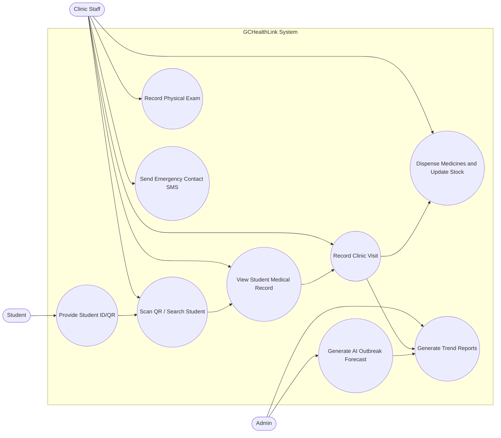
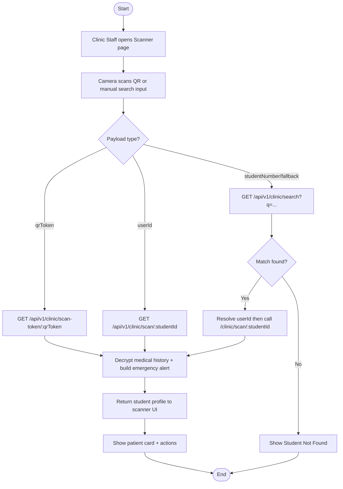
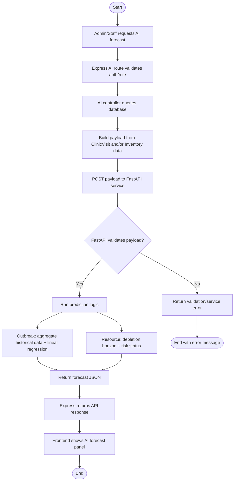
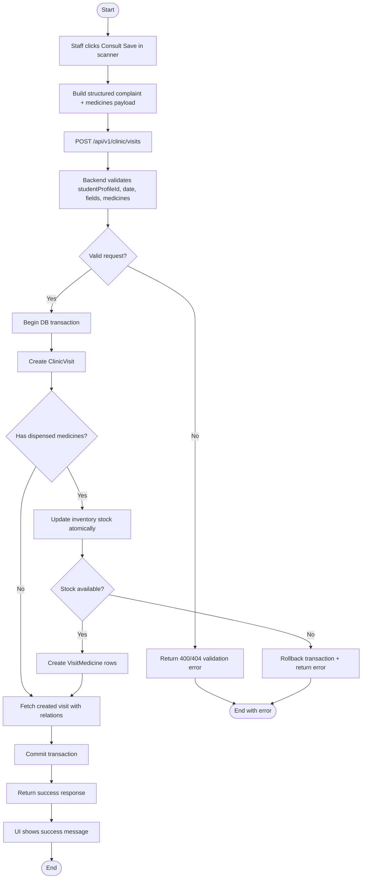
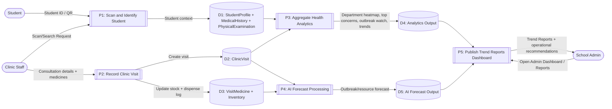

# 3.5 System Diagrams - GCHealthLink

This document is based on the current implementation in the monorepo:
- Backend API mounts under `/api/v1/*`
- Clinic scanning and visit logging flow in `clinic.routes.js` and `clinic.controller.js`
- Admin analytics flow in `admin.routes.js` and `admin.controller.js`
- AI bridge flow in `ai.routes.js`, `ai.controller.js`, and `ai-service-python/main.py`
- Data model in `prisma/schema.prisma`

## 3.5.1 Use Case Diagram

Actors requested:
- Clinic Staff: scans and records clinic data
- Students: provide student ID/QR for identification

Additional system actor shown:
- Admin: consumes trend reports



## 3.5.2 Activity Diagrams

### A. QR Code Scanning Activity



### B. AI Health Summary / Forecast Activity

Note: Current implementation exposes AI forecasting (`/api/v1/ai/outbreak-forecast` and `/api/v1/ai/resource-prediction`).



### C. Save Clinic Visit Activity



## 3.5.3 Entity Relationship Diagram (ERD)

Focus requested: Student IDs, Medical Histories, Vital Signs, and how they connect.

```mermaid
erDiagram
    USER ||--o| STUDENT_PROFILE : owns
    STUDENT_PROFILE ||--o| MEDICAL_HISTORY : has
    STUDENT_PROFILE ||--o{ PHYSICAL_EXAMINATION : has
    STUDENT_PROFILE ||--o{ CLINIC_VISIT : receives
    USER ||--o{ CLINIC_VISIT : handles
    CLINIC_VISIT ||--o{ VISIT_MEDICINE : includes
    INVENTORY ||--o{ VISIT_MEDICINE : dispensed_from
    STUDENT_PROFILE ||--o{ LAB_RESULT : has

    USER {
      string id PK
      string email UK
      enum role
      string qrToken
    }

    STUDENT_PROFILE {
      string id PK
      string userId FK UK
      string studentNumber UK
      string firstName
      string lastName
      string courseDept
      int age
      string sex
    }

    MEDICAL_HISTORY {
      string id PK
      string studentProfileId FK UK
      string allergyEnc
      string asthmaEnc
      string diabetesEnc
      string hypertensionEnc
      string operationNatureAndDateEnc
    }

    PHYSICAL_EXAMINATION {
      string id PK
      string studentProfileId FK
      date examDate
      enum yearLevel
      string bp
      string cr
      string rr
      string temp
      string height
      string weight
      string bmi
    }

    CLINIC_VISIT {
      string id PK
      string studentProfileId FK
      string handledById FK
      date visitDate
      string visitTime
      string chiefComplaintEnc
      string concernTag
    }

    VISIT_MEDICINE {
      string id PK
      string visitId FK
      string inventoryId FK
      int quantity
    }

    INVENTORY {
      string id PK
      string itemName UK
      int currentStock
      int reorderThreshold
      string unit
    }

    LAB_RESULT {
      string id PK
      string studentProfileId FK
      date date
      string bloodType
      string xrayFindingsEnc
    }
```

## 3.5.4 Data Flow Diagram (DFD)

Target flow requested: clinic visit data moving into AI processing and producing Trend Reports for administration.



---

## Notes for your manuscript

- If your panel expects strict UML notation, convert the 3.5.1 flowchart into UML use case ovals/associations in draw.io or StarUML.
- If your panel expects formal DFD notation (Yourdon/DeMarco), keep the same processes and data stores, then redraw with circles/processes and open-ended data stores.
- Current implementation has two analytics paths:
  - Aggregated analytics from backend (`/api/v1/admin/analytics`) used by Admin Reports.
  - AI microservice forecasts via backend bridge (`/api/v1/ai/outbreak-forecast`, `/api/v1/ai/resource-prediction`).
